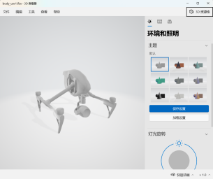
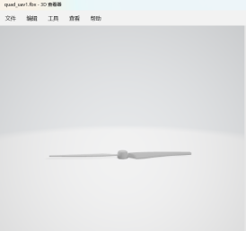
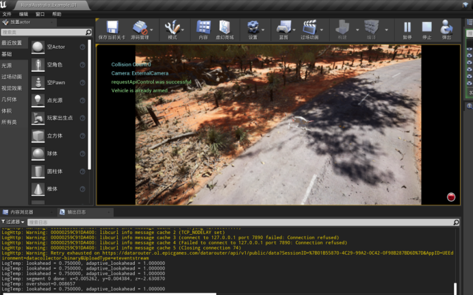
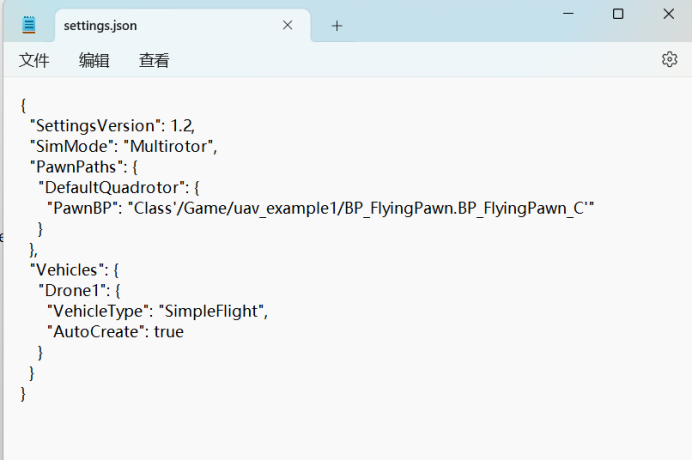
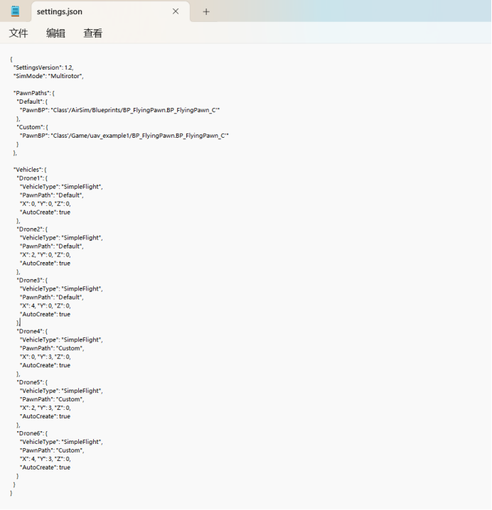
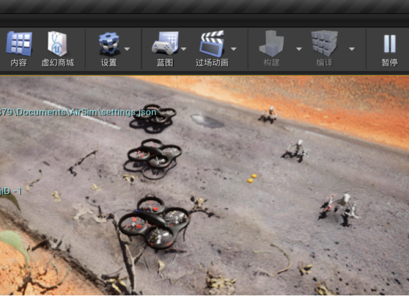

# week 4-5 #
下载一个3d无人机模型用blender分离出来机身和旋翼：

  
  

导入到ue4中，利用airsim自带的无人机蓝图文件，用导入进来的机身和旋翼更改原有的FlyPawn蓝图(需保持旋翼和机身电机的连接)。然后在settings.json中添加pawnpath项，运行可得结果：

配置了六台无人机其中三台无人机采用默认蓝图，三台无人机采用自定义蓝图。根据官方settings.json文件说明修改settings.json文件：

并进行了默认蓝图和自定义蓝图的编队飞行，并获取图像

快速学习huggingface相关agent课程，利用smolagent构建简单agent，熟悉了smolagent的基本用法

