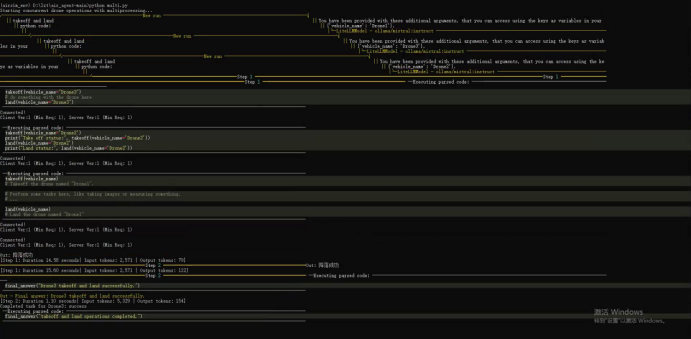
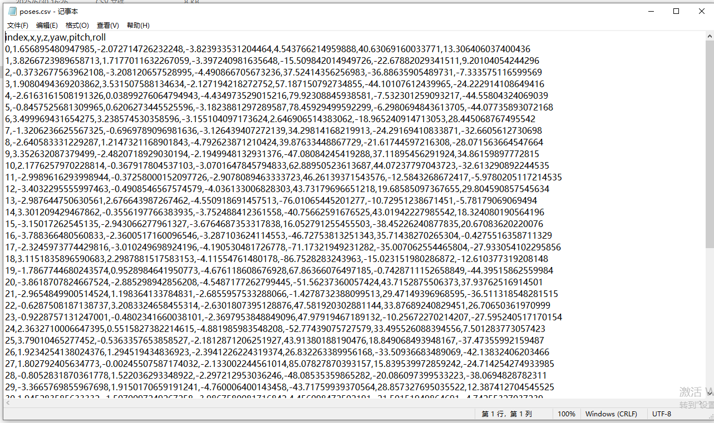
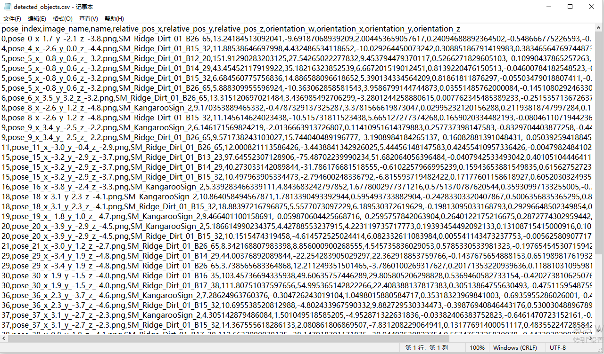
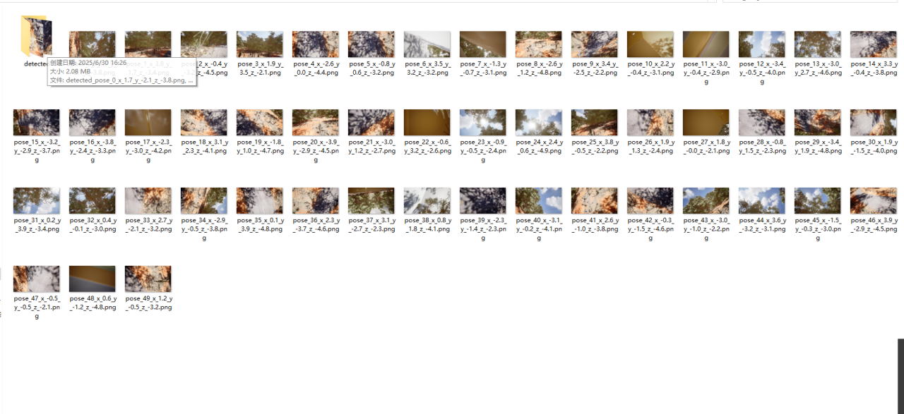
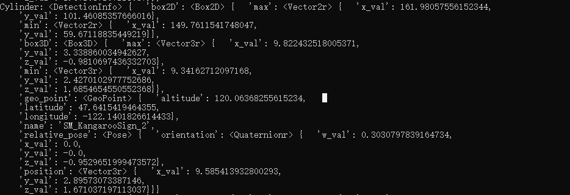

# week 6-8
利用ollama拉取了mistral模型（代码生成能力较弱），换成了deepseek R1：8b（smolagent通用模型约束要求写给模型的prompt必须包含结构化代码块格式，deep seek模型中返回的推理内容没有完全遵守这个格式报错），qwen3:32b（显存不够） 尝试了phi3:mini(太弱不适合agent多工具调用任务)，最后尝试了模型mistral:instruct可行。



后续用了qwen2:7b-instruct，规划和执行更稳定

修改airsim自带的detection的function来识别场景里的objects,并且整合到airsim_wrapper.py里充当一个tool

```
def detect_objects(vehicle_name: str) -> str:
    client = airsim.MultirotorClient()
    client.confirmConnection()
    camera_name = "0"
    image_type = airsim.ImageType.Scene

    def quaternion_to_rotation_matrix(q):
        """
        将 AirSim 的 Quaternionr 转换为 3x3 旋转矩阵（右手坐标系）
        """
        w, x, y, z = q.w_val, q.x_val, q.y_val, q.z_val

        r00 = 1 - 2 * (y * y + z * z)
        r01 = 2 * (x * y - z * w)
        r02 = 2 * (x * z + y * w)

        r10 = 2 * (x * y + z * w)
        r11 = 1 - 2 * (x * x + z * z)
        r12 = 2 * (y * z - x * w)

        r20 = 2 * (x * z - y * w)
        r21 = 2 * (y * z + x * w)
        r22 = 1 - 2 * (x * x + y * y)

        return np.array([
            [r00, r01, r02],
            [r10, r11, r12],
            [r20, r21, r22]
        ])

    # 设置检测参数
    client.simSetDetectionFilterRadius(camera_name, image_type, 200 * 100)
    # 定义你需要检测的多个 mesh 模式
    mesh_patterns = [
        "SM_KangarooSign*",
        "FX_Birds*",
        "SM_Ridge_Dirt*",
        "FX_LeavesFalling*"
    ]

    # 批量添加到检测过滤器中
    for pattern in mesh_patterns:
        client.simAddDetectionFilterMeshName(camera_name, image_type, pattern)

    # 图像保存目录
    save_dir = "all_images"
    detect_dir = os.path.join(save_dir, "detected")
    os.makedirs(save_dir, exist_ok=True)
    os.makedirs(detect_dir, exist_ok=True)

    # 加载位姿 CSV
    poses = pd.read_csv("poses.csv")

    # 初始化保存目标检测信息
    detection_records = []

    for i, row in poses.iterrows():
        # 设置无人机位姿
        x, y, z = float(row['x']), float(row['y']), float(row['z'])
        yaw, pitch, roll = float(row['yaw']), float(row['pitch']), float(row['roll'])
        pose = airsim.Pose(airsim.Vector3r(x, y, z), airsim.to_quaternion(pitch, roll, yaw))
        client.simSetVehiclePose(pose, True)
        time.sleep(0.5)  # 或使用轮询状态确保位置更新完成
        state = client.getMultirotorState()
        drone_pos = state.kinematics_estimated.position
        drone_ori = state.kinematics_estimated.orientation

        # 获取图像
        raw = client.simGetImage(camera_name, image_type)
        if raw is None:
            continue

        img = cv2.imdecode(airsim.string_to_uint8_array(raw), cv2.IMREAD_UNCHANGED)

        # 保存原始图像（不管是否检测）
        fname = f"pose_{i}_x_{x:.1f}_y_{y:.1f}_z_{z:.1f}.png"
        filepath = os.path.join(save_dir, fname)
        cv2.imwrite(filepath, img)

        # 检测目标
        detections = client.simGetDetections(camera_name, image_type)
        if detections:
            img_copy = img.copy()
            for det in detections:
                # 框出目标
                cv2.rectangle(img_copy,
                              (int(det.box2D.min.x_val), int(det.box2D.min.y_val)),
                              (int(det.box2D.max.x_val), int(det.box2D.max.y_val)),
                              (0, 255, 0), 2)
                cv2.putText(img_copy, det.name,
                            (int(det.box2D.min.x_val), int(det.box2D.min.y_val - 10)),
                            cv2.FONT_HERSHEY_SIMPLEX, 0.5, (36, 255, 12), 1)
                # changed
                rel_pos = det.relative_pose.position
                rel_vec = np.array([rel_pos.x_val, rel_pos.y_val, rel_pos.z_val])

                # 将四元数转换为旋转矩阵
                # rotation = airsim.to_rotation_matrix(drone_ori)  # 某些版本为 airsim.to_rotation_matrix
                rotation = quaternion_to_rotation_matrix(drone_ori)

                # 变换后的世界坐标位置
                world_vec = np.dot(rotation, rel_vec) + np.array([drone_pos.x_val, drone_pos.y_val, drone_pos.z_val])

                detection_records.append({
                    "pose_index": i,
                    "image_name": fname,
                    "name": det.name,
                    "world_pos_x": world_vec[0],
                    "world_pos_y": world_vec[1],
                    "world_pos_z": world_vec[2],
                    "orientation_w": det.relative_pose.orientation.w_val,
                    "orientation_x": det.relative_pose.orientation.x_val,
                    "orientation_y": det.relative_pose.orientation.y_val,
                    "orientation_z": det.relative_pose.orientation.z_val,
                })

            # 另存带标注图像
            detect_path = os.path.join(detect_dir, f"detected_{fname}")
            cv2.imwrite(detect_path, img_copy)

    # 保存目标信息为 CSV
    if detection_records:
        df = pd.DataFrame(detection_records)
        df.to_csv("detected_objects.csv", index=False)

    print("全部图像与检测信息保存完成")
```










