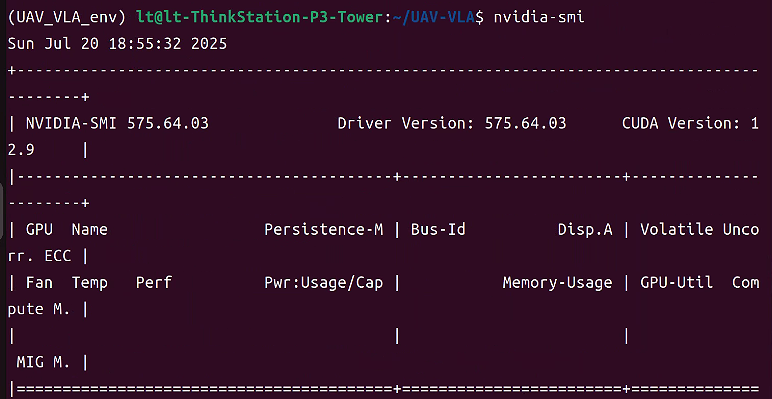
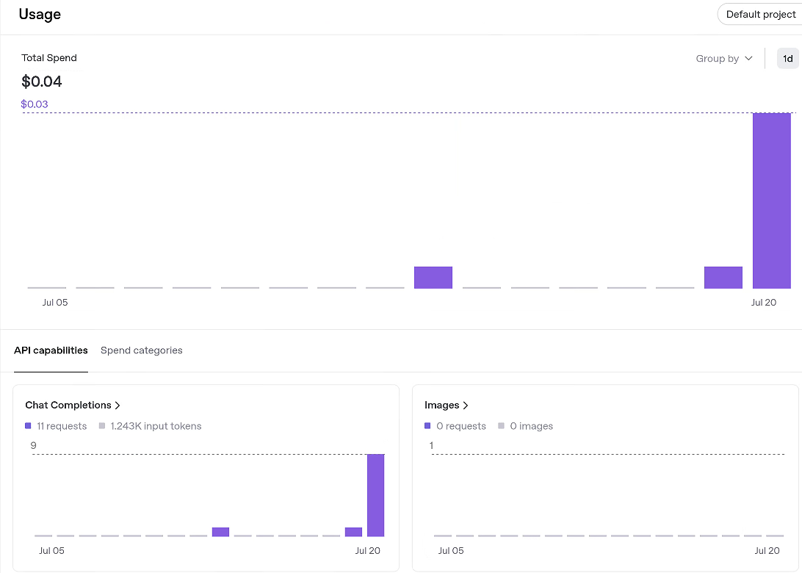

# week 9

安装了Windows 11 + Ubuntu 22.04双系统，安装了CUDA && Cudnn 来加速gpu



配置虚拟环境用来复现UAV_VLA项目

项目地址：https://github.com/Sautenich/UAV-VLA

```
pip install -r requirements.txt
```

numpy版本有问题需要降级，缺失cv2的问题需要解决

```
pip install opencv-python
pip install numpy==1.26.4
```

 LangChain 在调用 LLM 时的变量格式问题，需要修改config.py里的step_1_template部分

```
# Prompt Templates
step_1_template = """
Extract all types of objects the drone needs to find from the following mission description:
"{command}"

Output the result in JSON format with a list of object types.
Example output:
{{
    "object_types": ["village", "airfield", "stadium", "tennis court", "building", "ponds", "crossroad", "roundabout"]
}}
"""
```

```
2025-07-20 19:54:44,527 - __main__ - ERROR - Error processing image 27: CUDA out of memory. Tried to allocate 1.53 GiB. GPU 0 has a total capacity of 23.49 GiB of which 1.50 GiB is free. Including non-PyTorch memory, this process has 20.91 GiB memory in use. Of the allocated memory 6.37 GiB is allocated by PyTorch, and 15.89 MiB is reserved by PyTorch but unallocated. If reserved but unallocated memory is large try setting PYTORCH_CUDA_ALLOC_CONF=expandable_segments:True to avoid fragmentation.  See documentation for Memory Management  (https://pytorch.org/docs/stable/notes/cuda.html#environment-variables)
```

显存不够，暂时无法运行




